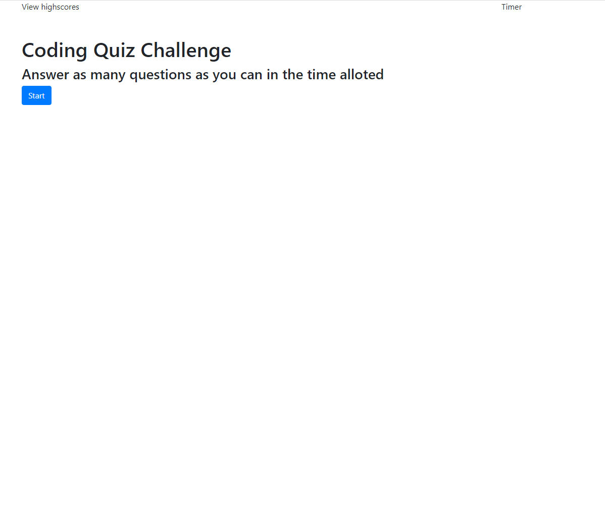

# codeQuiz
A timed, multiple choice coding quiz

## Description
A 60 second quiz with questions taken from the online quiz from materials provided in class. Use the start button to generate questions. Missing a question removes 5 seconds from the timer. Questions immediately generate the next one upon choosing your answer with a small display with user feedback. Once you run out of questions or the timer hits zero the quiz with end. 1 point is awarded for each right answer. Your score will display next to a box to insert your initials. This score and initials are supposed to store locally and display in an unordered list. However I couldn't get the .push function to work properly so the highscore display is messy. Also unable to get to styling things or adding a button to retry the quiz. Code is currently unorganized as I tried everything to get the high score table to work. 

## Screenshots

### Link
https://noheropage.github.io/codeQuiz/ 